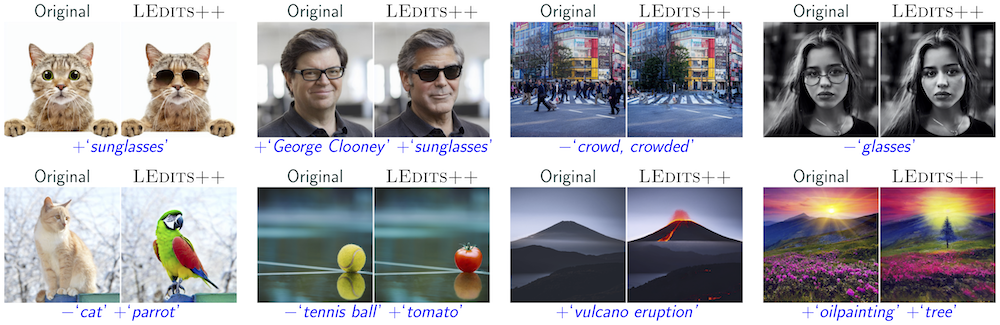

# LEdits++

Official Implementation of the [Paper](https://arxiv.org/abs/2311.16711) **LEDITS++: Limitless Image Editing using Text-to-Image Models**. 


## Interactive Demo
An interactive demonstration is available in Colab and on Huggingface [](https://colab.research.google.com/github/ml-research/ledits_pp/blob/main/examples/LEdits.ipynb) [](https://huggingface.co/spaces/editing-images/ledtisplusplus)

[Project Page](https://leditsplusplus-project.static.hf.space/index.html)



## Installation
LEdits++ is fully integrated in the ```diffusers``` library as ```LEditsPPPipelineStableDiffusion``` and ```LEditsPPPipelineStableDiffusionXL```, respectively. Just install diffusers to use it:

```cmd
pip install diffusers
```

Notably, the diffusers implementation does NOT guarantee perfect inversion. If that is a required property for your use case or you are performing research based on LEdits++, we recommend using the implementation in this repository instead.

## Usage
This repository provides 3 new diffusion pipelines supporting image editing based on the [diffusers](https://github.com/huggingface/diffusers) library.
The ```StableDiffusionPipeline_LEDITS```, ```StableDiffusionPipelineXL_LEDITS``` and ```IFDiffusion_LEDITS``` extend the respective diffusers pipelines and can therefore be loaded from any corresponding pre-trained checkpoint like shown below.


```python
import PIL
import requests
import torch
from io import BytesIO
from scheduling_dpmsolver_multistep_inject import DPMSolverMultistepSchedulerInject
from pipeline_stable_diffusion_ledits import  StableDiffusionPipeline_LEDITS

model = 'runwayml/stable-diffusion-v1-5'
#model = '/workspace/StableDiff/models/stable-diffusion-v1-5'

device = 'cuda'

pipe = StableDiffusionPipeline_LEDITS.from_pretrained(model,safety_checker = None,)
pipe.scheduler = DPMSolverMultistepSchedulerInject.from_pretrained(model, subfolder="scheduler"
                                                             , algorithm_type="sde-dpmsolver++", solver_order=2)
pipe.to(device)


An exemplary usage of the pipeline could look like this:
```python
def download_image(url):
    response = requests.get(url)
    return PIL.Image.open(BytesIO(response.content)).convert("RGB")
gen = torch.Generator(device=device)

gen.manual_seed(21)
img_url = "https://www.aiml.informatik.tu-darmstadt.de/people/mbrack/cherry_blossom.png"
image = download_image(img_url)
_ = pipe.invert( image = image,
    num_inversion_steps=50,
    skip=0.1
    )
edited_image = pipe(
    editing_prompt=["cherry blossom"],
    edit_guidance_scale=10.0,
    edit_threshold=0.75,
        ).images[0]
```

## Citation
If you like or use our work please cite us:
```bibtex
@article{brack2023Sega,
       title={LEDITS++: Limitless Image Editing using Text-to-Image Models}, 
      author={Manuel Brack and Felix Friedrich and Katharina Kornmeier and Linoy Tsaban and Patrick Schramowski and Kristian Kersting and Apolinário Passos},
      year={2023},
      eprint={2311.16711},
      archivePrefix={arXiv},
      primaryClass={cs.CV}
}
```

